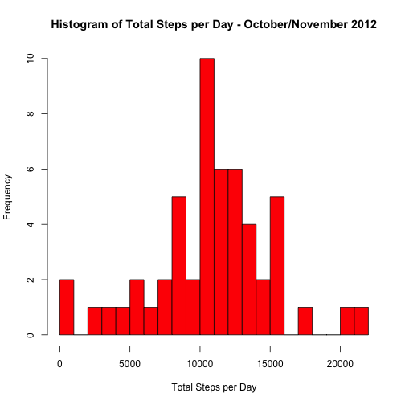
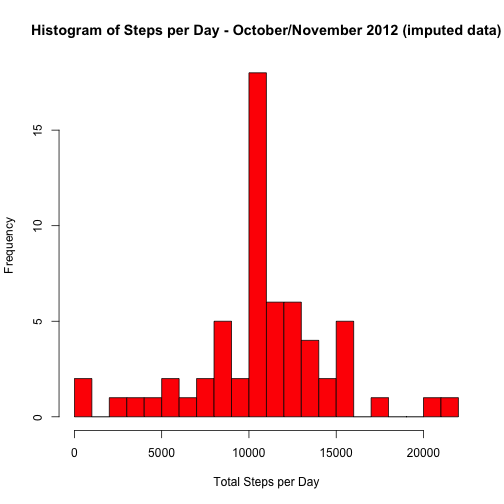
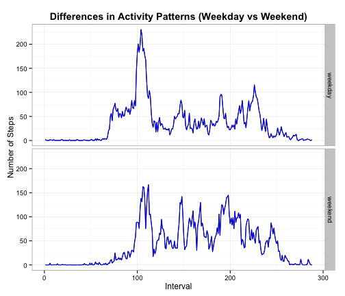

# Reproducible Research: Peer Assessment 1
This assignment makes use of data from a personal activity monitoring device. This device collects data at 5 minute intervals through out the day. The data consists of two months of data from an anonymous individual collected during the months of October and November, 2012 and include the number of steps taken in 5 minute intervals each day.

The variables in the dataset are:

+ **steps:** Number of steps taking in a 5-minute interval (missing values are coded as NA)
+ **date:** The date on which the measurement was taken in YYYY-MM-DD format
+ **interval:** Identifier for the 5-minute interval in which measurement was taken

## Loading and preprocessing the data

The following code reads the data from the "R Working Directory". The interval variable is preprocessed and coverted to a factor variable.

```r
data <- read.csv("activity.csv")
data$interval <- factor(data$interval)
```


## What is mean total number of steps taken per day?

```r
options(scipen = 8)
steps_per_day <- with(data, tapply(steps, date, sum))
hist(steps_per_day, breaks = 20, main = "Histogram of Total Steps per Day - October/November 2012", xlab = "Total Steps per Day", col = "red")
```

 

```r
mean_steps <- round(mean(steps_per_day, na.rm = TRUE), digits = 2)
median_steps <- median(steps_per_day, na.rm = TRUE)
mean_steps
```

```
## [1] 10766
```

```r
median_steps
```

```
## [1] 10765
```
The mean steps per day is: **10766.19**  
The median steps per day is: **10765**

## What is the average daily activity pattern?

```r
steps_per_interval <- with(data, tapply(steps, interval, mean, na.rm = TRUE))
plot(names(steps_per_interval), steps_per_interval, type = "l", main = "Average Daily Pattern - October/November 2012", xlab = "5-minute Interval (from 00:00 to 23:55)", ylab = "Number of Steps")
```

 

```r
max_interval <- steps_per_interval[steps_per_interval == max(steps_per_interval)]
max_interval
```

```
##   835 
## 206.2
```
The 5-minute interval with the highest average number of steps is the interval that starts at **835**.  
The average number of steps taken in this interval were: **206.1698**.


## Imputing missing values
In this block, we deal with missing data. The strategy is to assign all intervals with NA values the average of the interval across both months. To accomplish this, the "average steps per interval" data is merged with the original data, to create a new dataset. The data was joined on the "interval" variable. Before the join, the "average steps" data was put in a data frame.  


```r
missing_rows <- sum(is.na(data$steps))
missing_rows
```

```
## [1] 2304
```

```r
averages_to_merge <- data.frame(interval = names(steps_per_interval), average_steps = as.numeric(steps_per_interval))
merged_data <- merge(data, averages_to_merge)
for (i in 1:nrow(merged_data)){
    if (is.na(merged_data[i, "steps"])){
        merged_data[i, "steps"] <- merged_data[i, "average_steps"]
    }
}
merged_data <- merged_data[order(merged_data[, "date"], merged_data[,"interval"]),]
new_dataset <- merged_data[, c("steps", "date", "interval")]


options(scipen = 8)
steps_per_day2 <- with(new_dataset, tapply(steps, date, sum))
hist(steps_per_day2, breaks = 20, main = "Histogram of Steps per Day - October/November 2012 (imputed data)", xlab = "Total Steps per Day", col = "red")
```

 

```r
mean_steps2 <- round(mean(steps_per_day2, na.rm = TRUE), digits = 2)
median_steps2 <- median(steps_per_day2, na.rm = TRUE)
mean_steps2
```

```
## [1] 10766
```

```r
median_steps2
```

```
## [1] 10766
```
The total number of rows missing step data is **2304**.  
From observation we can see that imputing the missing values with the average steps per interval has had little to no effect on the mean and median values.  
The mean value and median values stay constant, within one step.  


## Are there differences in activity patterns between weekdays and weekends?

```r
new_dataset$day <- weekdays(as.Date(new_dataset$date))
new_dataset$weekend <- "weekday"
new_dataset[new_dataset$day == "Saturday" | new_dataset$day == "Sunday", "weekend"] <- "weekend"
new_dataset$weekend <- factor(new_dataset$weekend)
dayofweek_data <- with(new_dataset, aggregate(steps, by = list(weekend, as.numeric(interval)), mean))
names(dayofweek_data) <- c("day", "interval", "steps")
library(ggplot2)
qplot(interval, steps, data = dayofweek_data, facets = day ~ ., geom = "line", main = expression(bold("Differences in Activity Patterns (Weekday vs Weekend)")), xlab = "Interval", ylab = "Number of Steps") + geom_line(color = "blue") + theme_bw()
```

 
